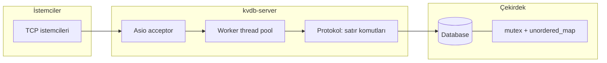

<p align="center">
  
  
  
  
  
</p>

<h1 align="center">VeloDB</h1>

<p align="center">
  <strong>Gerçek zamanlı uygulamalar için hafif, hızlı ve net bir anahtar–değer motoru.</strong><br />
  <em>Minimal çekirdek, asenkron ağ katmanı ve üretim yoluna uygun modern C++20.</em>
</p>

---

## Ne sunuyor?

VeloDB, **bellek içi** bir anahtar–değer deposu ve **TCP tabanlı** satır komut arayüzünü aynı pakette toplar. Redis benzeri komutlarla istemciler hızlıca prototip ve entegrasyon kurabilir; çekirdek ise `std::unordered_map` üzerinde **tek bir tutarlı mutex** ile basit ve öngörülebilir eşzamanlılık modeli sunar.

| Özellik | Açıklama |
|--------|----------|
| **Ağ** | Asio ile kabul + çoklu iş parçacığında `io_context` |
| **Depolama** | String anahtar, `Value` modeli (isteğe bağlı `expire_at` alanı) |
| **Bellek izleme** | `used_memory` ve `max_memory` yapılandırması (`Database::Info`) |
| **Hash** | Anahtar hash’i **[xxHash](https://github.com/Cyan4973/xxHash) XXH3 64-bit** (`kvdb::utils::hash_key`) |
| **Yapı taşları** | `Config::shard_count` ve `src/db/*` iskelet dosyaları ileride sharding / motor için hazır |

## Mimari bakış



## Teknoloji yığını

| Bileşen | Sürüm / rol |
|---------|--------------|
| **Dil** | C++20 |
| **Ağ** | [Asio](https://think-async.com/Asio/) (Conan: `asio/1.30.2`) |
| **Hash** | [xxHash](https://github.com/Cyan4973/xxHash) `0.8.2`, CMake hedefi `xxHash::xxhash` |
| **Test hedefleri** | GTest (Conan’dan hazır; `tests/` bağlantısı genişletilebilir) |
| **Derleme** | CMake ≥ 3.16, Conan 2 toolchain |

## Dizin yapısı

```
VeloDB/
├── LICENSE
├── README.md                 ← Bu dosya
└── kvdb/                     ← C++ proje kökü
    ├── CMakeLists.txt
    ├── conanfile.txt
    ├── include/kvdb/       ← Genel başlıklar
    ├── src/                ← Uygulama ve kvdb-server
    ├── scripts/            ← build_release.sh, build_debug.sh
    ├── tests/                ← Test CMake gövdesi (genişlemeye müsait)
    ├── docs/                 ← Protokol ve mimari notları için
    └── benchmark/           ← Yer tutucu benchmark dosyaları
```

## Hızlı başlangıç

### Ön koşullar

- CMake **3.16+**
- **Conan 2.x** (`pip install conan` veya dağıtım paketi)
- C++20 uyumlu derleyici (GCC 11+, Clang 14+, MSVC uygun channel)

### Sürüm (önerilen)

```bash
cd kvdb
./scripts/build_release.sh
```

Bu betik Conan bağımlılıklarını yükler, `build/release/` içinde `conan_toolchain.cmake` ile CMake yapılandırır ve **`kvdb-server`** ikilisini üretir.

### Hata ayıklama sürümü

```bash
cd kvdb
./scripts/build_debug.sh
```

### Elle derleme (özet)

```bash
cd kvdb
mkdir -p build/release && cd build/release
conan install .. --output-folder=. --build=missing -s build_type=Release
cmake .. -DCMAKE_BUILD_TYPE=Release -DCMAKE_TOOLCHAIN_FILE=conan_toolchain.cmake
cmake --build .
```

Çıktı: `kvdb/build/release/kvdb-server` (yol Conan çıktı klasörüne göre değişebilir).

## Sunucuyu çalıştırma

```bash
./kvdb-server           # Varsayılan 6379
./kvdb-server 6380      # Özel port
```

Çıkmak için `SIGINT` / `SIGTERM` (ör. Ctrl+C).

## Protokol (metin tabanlı)

Her istek: **tek satır**, boşlukla ayrılmış argümanlar; yanıt metin + satır sonu.

| Komut | Kullanım | Davranış |
|-------|----------|----------|
| **SET** | `SET key value` | Anahtarı yazar / günceller → `OK` |
| **GET** | `GET key` | Değer veya `(nil)` |
| **DEL** | `DEL key` | Silindiyse `1`, yoksa `0` |
| **EXPIRE** | `EXPIRE key saniye` | `Value` üzerinde `expire_at` zaman damgasını ayarlar (`1` / `0`) |
| **PING** | `PING` | `PONG` |
| **INFO** | `INFO` | `used_memory`, `max_memory`, `db_keys` |

Örnek (netcat veya telnet):

```bash
printf 'SET merhaba dunya\nGET merhaba\nINFO\n' | nc 127.0.0.1 6379
```

## Şu anki davranışa dair net notlar

- **`shard_count`**: `Config` içinde tanımlıdır; mevcut `Database` uygulaması depolamayı **tek harita** üzerinde tutar. Sharding ve `src/db/*` modülleri projeyi büyütmek için iskelet olarak durur.
- **TTL**: `EXPIRE` süre sonu anını `Value::expire_at` alanına yazar; **okuma yolunda süresi dolmuş anahtarları otomatik eleme** henüz yoktur (ileride `GET`/bakım iş parçacığı ile tamamlanabilir).
- **Test CMake**: `KVDB_BUILD_TESTS=ON` ile `tests/` alt dizini dahil edilir; GTest ile somut test hedefleri eklendiğinde `tests/CMakeLists.txt` genişletilmelidir.
- **Benchmark**: `benchmark/` altında henüz anlamlı içerik yoktur; CMake yalnızca `benchmark/CMakeLists.txt` varsa alt projeyi ekler.

## İsim ve marka

**VeloDB** — «Velocity» ve veri tabanı ima eden kısa, akıcı bir isimdir. Çalışır ikili **`kvdb-server`** olarak adlandırılmıştır (kütüphane **`kvdb`**).

---

<p align="center">
  MIT Lisansı — Copyright (c) 2025 Mete YARICI<br />
  <sub>Çekirdek fikirler: basitlik, öngörülebilir performans, gelecek için temiz uzantı noktaları.</sub>
</p>
